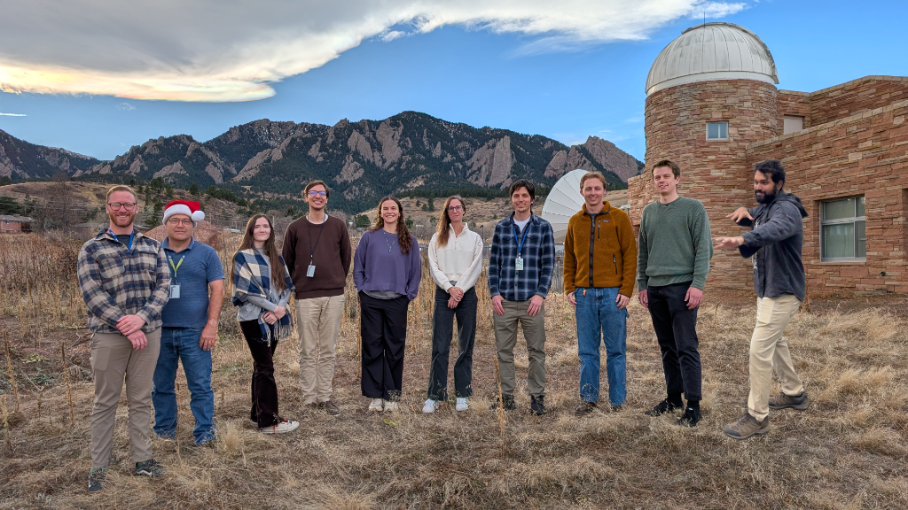
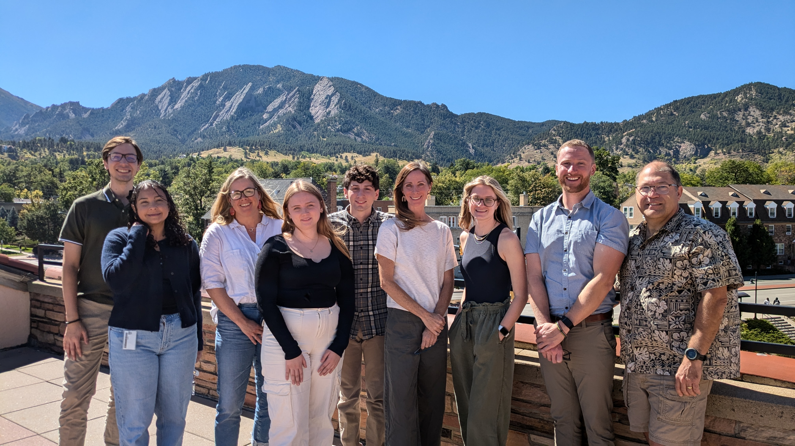
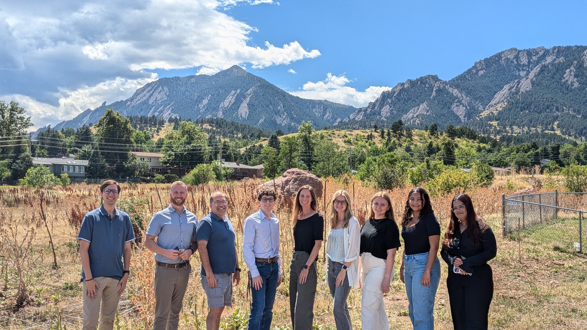

The CIRES at NCEI Ocean Acoustics Archive team (Team Fish) is composed of dedicated professionals working together to support a wide range of projects and data sources.

### Meet Our Team

Dr. Carrie Wall, Team Lead

Chuck Anderson, Sr Data Manager

Clint Lohr, Software Engineer

Quincy Cantu, Software Engineer

Brett Layman, Data Analyst for the AA-SI

Dominic Bashford, Data Analyst for the AA-SI

Elias Capriles, Data Analyst for the AA-SI

Emma Beretta, Passive Acoustic Data Analyst for ONMS

Rory O'Flynn, Junior Passive Acoustic Data Manager

Luke Pitstick, Junior Active Acoustic Data Manager

 

## Former Team Photos

 

 